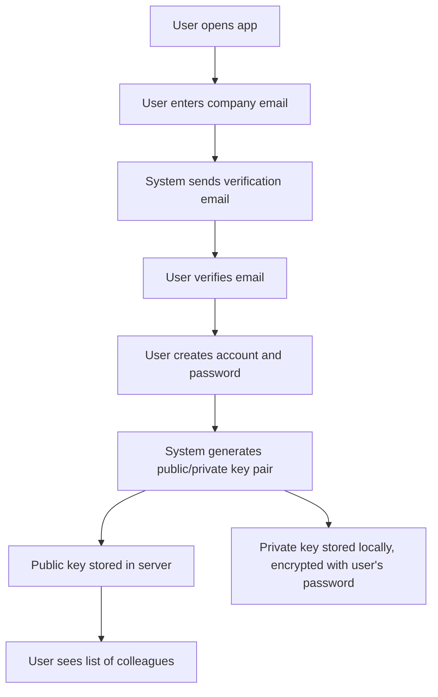

# User Registration Flow

```mermaid
flowchart TD
    A[User opens app] --> B[User enters company email]
    B --> C[System sends verification email]
    C --> D[User verifies email]
    D --> E[User creates account and password]
    E --> F[System generates public/private key pair]
    F --> G[Public key stored in server]
    F --> H[Private key stored locally, encrypted with user's password]
    G --> I[User sees list of colleagues]
``` 