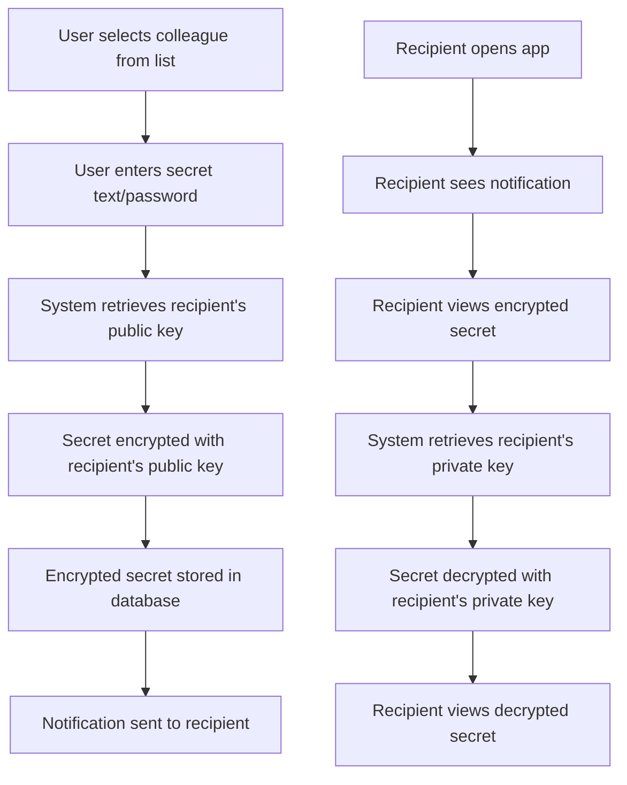

# Secret Sharing Flow

```mermaid
flowchart TD
    A[User selects colleague from list] --> B[User enters secret text/password]
    B --> C[System retrieves recipient's public key]
    C --> D[Secret encrypted with recipient's public key]
    D --> E[Encrypted secret stored in database]
    E --> F[Notification sent to recipient]
    G[Recipient opens app] --> H[Recipient sees notification]
    H --> I[Recipient views encrypted secret]
    I --> J[System retrieves recipient's private key]
    J --> K[Secret decrypted with recipient's private key]
    K --> L[Recipient views decrypted secret]
``` 